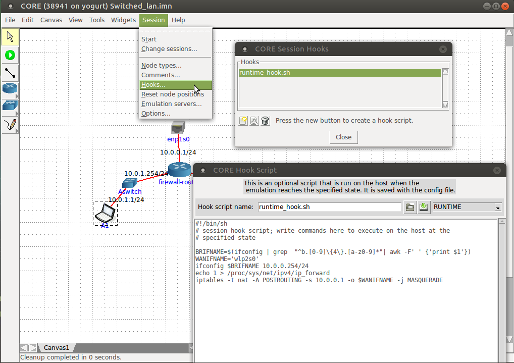
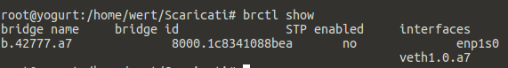
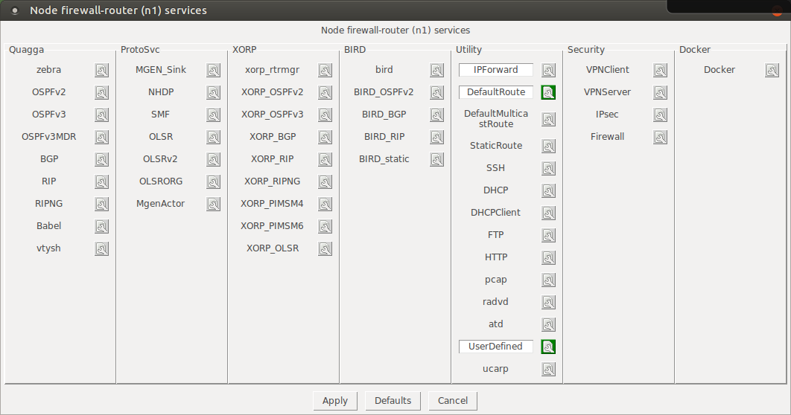
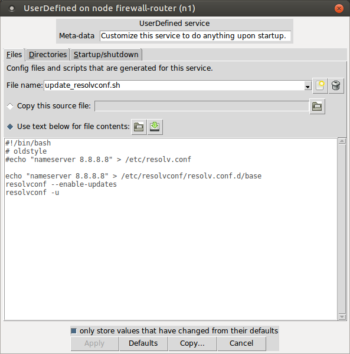
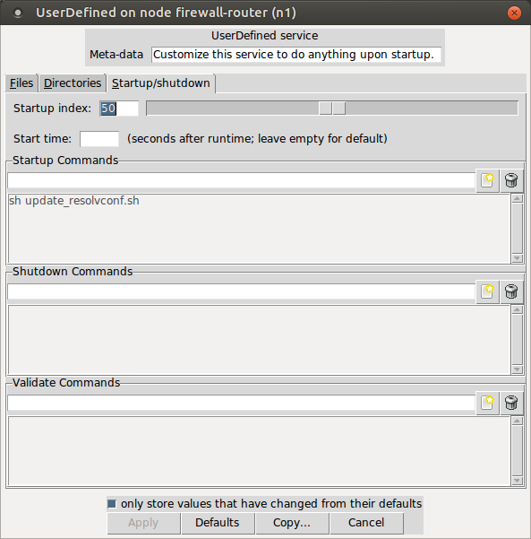
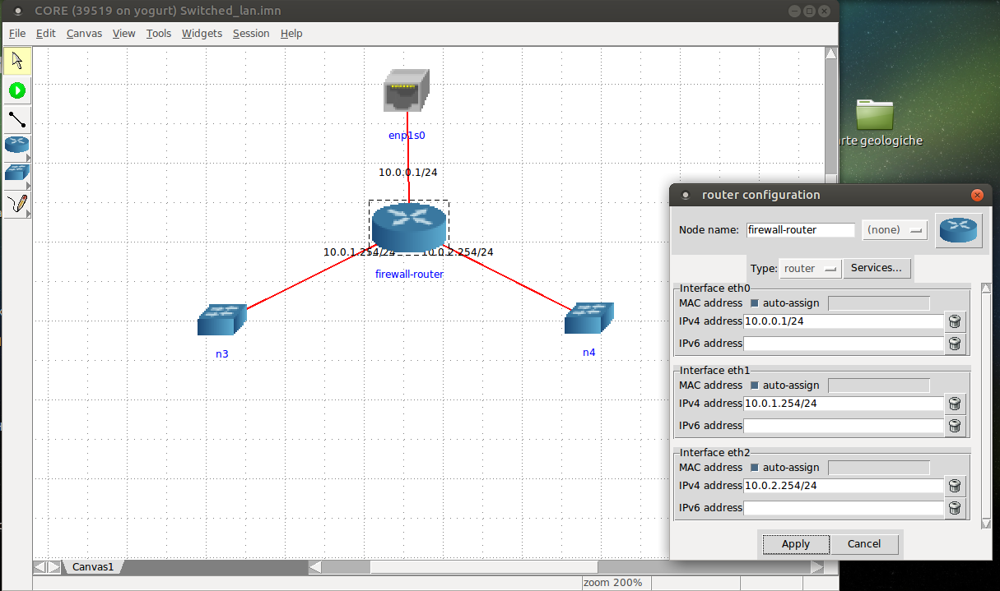
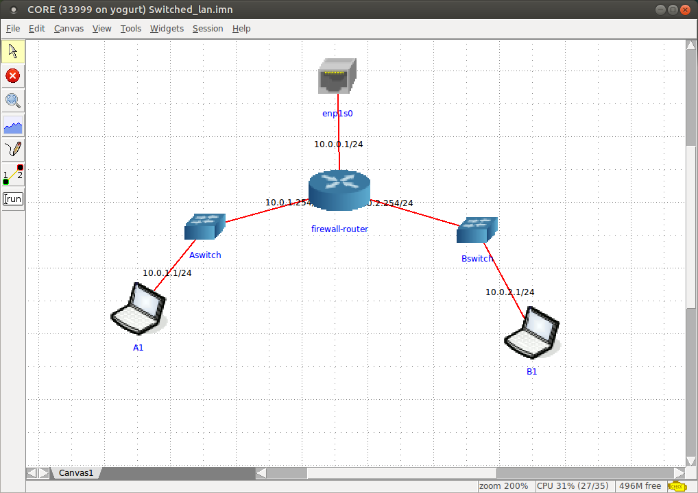

CORE Network Tutorial
---------------------

Follow these simple steps and get the base knowledge to use this wonderfull framework.

1. Install and Run CORE Network:
    - 1.1 Please download packages or VMware image available from [CORE Network official download page](https://www.nrl.navy.mil/itd/ncs/products/core)
    - 1.2 Install daemon and gui packages. _Hint: On ubuntu 16.04 and ubuntu 18.04 we got trusty packages to work._ 
    
2. add a Router and call it _firewall-router_, then add a physical interface to get a bridge on a real ifname on your workstation: 
    - 2.1 Configure (double click) the physical interface to bridge with a local ethernet interface of your workstation;
    - 2.2 remove ipv6 from _firewall_router_ if you don't need it;
    - _Hint: do not use wireless interface for bridging_

    **Problem: Every time you stop and start your CORE session the Bridge ifname will change on your workstation. Use a command to keep it always in touch.
    ````
    BRIFNAME=$(ifconfig | grep  "^b.[0-9]\{4\}.[a-z0-9]*"| awk -F' ' {'print $1'})
    ````    
    To make this and other things persistent got o _Session -> Hooks_ and configure as follow in picture:
    

3. Run this first test.
    - 3.1 open a terminal on your workstation, check available interfaces (`ifconfig` or `ip ad sh`). You will see at least two brand new interfaces, veth* and b.*. 
    - 3.2 run `brctl show` to check what of the interfaces is a bridge (probably b.*). You will also see that veth* is a interfaces linked to this bridge.
    
    
    
    
    
    - 3.3 run `tcpdump -i $BRIFNAME` on your workstation, you will see traffic from the _firewall_router_.  Double click on _firewall_router_, it will open a terminal, see network the network interfaces and check its HWaddress, it's the same showned in the tcpdump stdout.
    ````
    tcpdump -i $BRIFNAME
    tcpdump: verbose output suppressed, use -v or -vv for full protocol decode
    listening on b.42777.a7, link-type EN10MB (Ethernet), capture size 262144 bytes
    16:53:35.441144 IP 0.0.0.0.bootpc > 255.255.255.255.bootps: BOOTP/DHCP, Request from 00:00:00:aa:00:00 (oui Ethernet), length 300
    16:53:44.446805 IP 0.0.0.0.bootpc > 255.255.255.255.bootps: BOOTP/DHCP, Request from 00:00:00:aa:00:00 (oui Ethernet), length 300
    ````

4. configure lan from your workstation with _firewall_router_. Remeber that $BRIFNAME it's only a variable name, this will have a different value on your setup!
    - 4.1 `ifconfig $BRIFNAME 10.0.0.254/24` or `ip ad ch 10.0.0.254/24 dev $BRIFNAME`
    - 4.2 ping _firewall_router_. Good news, a working layer2 was creted from your workstation to your CORE Network project!
    - 4.3 Disable unecessary routing services
        
    
5. Enable supernetting, _firewall_router_ must reach internet. All these task must be executed on your workstation.
    - 5.1 Enable ip_forward `echo 1 >  /proc/sys/net/ipv4/ip_forward`
    - 5.2 NAT all the traffic from the bridge to internet using iptables. What's your ifname linked to internet? That is the output interface!
        `iptables -t nat -A POSTROUTING -s 10.0.0.1 -o wlp2s0 -j MASQUERADE`
        10.0.0.1 is the ip of _firewall_router_, wlp2s0 is the wireless interface that I'm using on my workstation to reach internet
    - 5.3 tell to _firewall_router_ its brancd new default gateway, add it:
        `route add default gw 10.0.0.254`
    - 5.4 from "firewall-route" test a foreign `ping to 8.8.8.8` for example, you must see it work! Made persistent this route.
        

6. Make persistent configuration with _firewall_router_ and CORE Network hook services:
    - 6.1 Also update resolv.conf into _firewall_router_ if you need it
        
        
    
7. Create Collision Zones, switched LANs in Core Network
    - 7.1 Add network switches
        
    - 7.2 Add Nodes in the A and in the B zone with compatible IPs.
    - 7.3 in A1 and B1 change services.DefaultRoute with correct _firewall_router_ ip
    - 7.4 do tracepatch from A1 to B1 and viceversa, please test if networks are now linked with _firewall_router_

8. Add some rule in _firewall_router_ configuration:
    - 8.1 Network A must reach internet and not B.
        - 8.1.1 Enable services.firewall in _firewall_router_
        - 8.1.2 Reject traffic in FORWARD chain, from A to B
          ````
          # accept returning packets from B to A, otherwise packets from B will not be forwarded
          # this means that if B reach A the forward will works because it was previously established 
          iptables -A FORWARD -m state --state RELATED,ESTABLISHED -j ACCEPT
          
          # REJECT traffic from A to B, ip_forward will works but this rule will reject the packets
          iptables -A FORWARD -s 10.0.1.0/24 -d 10.0.2.0/24 -j REJECT
          ````
        - 8.1.2 Add masquerade rule to NAT all the traffic from A to Internet
          ````
          iptables -t nat -A POSTROUTING -s 10.0.1.0/24 -o eth0 -j MASQUERADE
          ````
    - 8.2 Network B must reach Internet and A
        - 8.1.2 Add masquerade rule to NAT all the traffic from B to Internet
          ````
          iptables -t nat -A POSTROUTING -s 10.0.2.0/24 -o eth0 -j MASQUERADE
          ````



# TODO
- Make the tasks described in 8. without iptables. _Hint: Linux Advanced Routing and blackholes_.
- Please suggest use case opening a git PR!
